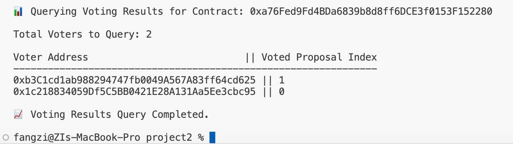

# Encode Club EVM Bootcamp, Q4 2024, Group 2, Homework #2

## Contract deployed using hardhat:
Ballot contract deployed to: 0xf664e989fa71437bfa26e666051f2b471e595035
Last block number: 7001248n
Deployer address: 0x1c218834059df5c5bb0421e28a131aa5ee3cbc95
Deployer balance: 0.054574199575297148 ETH
Transaction hash: 0x4914f6082033b4969fc20b21d3f7ffdfe2cbf215850c7d36261f22463a233ac1

## Contract deployed using viem:
Ballot contract deployed to: 0xa76fed9fd4bda6839b8d8ff6dce3f0153f152280
Last block number: 7005272n
Deployer address: 0x1c218834059df5c5bb0421e28a131aa5ee3cbc95
Deployer balance: 0.051469531775892676 ETH
Transaction hash: 0x0f6d69486031934c028507ec4c1c3b90cd4303595a3494567b4f7f8dbad4e008

The functions are executed using the contract deployed with Viem. 

## GiveVotingRight
Transaction hash: 0x3782c417a40fa0b93f248d4e8de74f263dd2bb564af30cf6f86fc791b272a2a3

## Vote
Transaciton hash: 0x37cc3286b2e1eeede5481727a94f10e3a035a768c89c8a5a815473aab24b9189

## Delegate
Transaction hash: 0x6960ef8397b6acb35f5d272deb0e21cef1987cfc83bbb37df4a783f9adaaceb3

## Query results

## What is not yet working
Error handling is not working likely due to datatype mismatch. 

